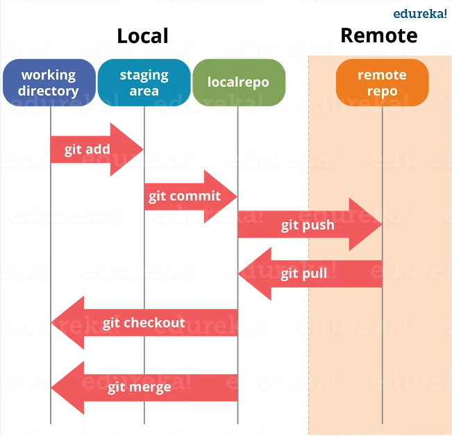
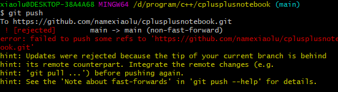
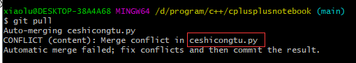

## git 基本用法



### 本地什么都没有，远程有的话

1. git clone 地址   将远程库的东西搞下来
2. 更改文件内容
3. git add <文件> 将文件增加到暂存区  可以用git add . 将所有文件都提交到暂存区
4. git commit -m “这里写提交的备注”   将暂存区的内容提交到本地仓库
5. git push 提交到远程仓库

## 之后修改的时候

git pull 就可以

## 遇到冲突

当我们在本地改一个文件的的某一行的时候，这个文件的这一行碰巧被别人修改了。此时会出现冲突。

现象就是：当我们正常提交到远程的时候他会报错


这时候我们需要从远端把最新代码pull下来



他会告诉我们 这个文件有冲突，我们需要把这个文件修改一下。

打开冲突的文件是这样的

我习惯用vscode修改：


改完之后 正常 add commit push 即可。

## 分支

### 远程有分支本地没有

```undefined
1.将某个远程主机的更新，全部取回本地：git fetch

2.查看远程分支：git branch -a

3.拉取远程分支到本地：git checkout -b 远程分支名 origin/远程分支名
```

### 本地新建分支，远程仓库没有

1. 创建分支并切换到该分支
     git checkout -b 新分支名
2. 创建分支，但不切换
     git branch 新分支名
3. 将创建的分支关联远程仓库
   	git push --set-upstream origin 分支名
