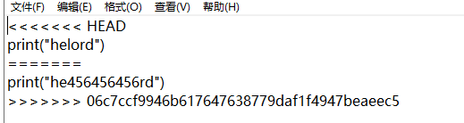
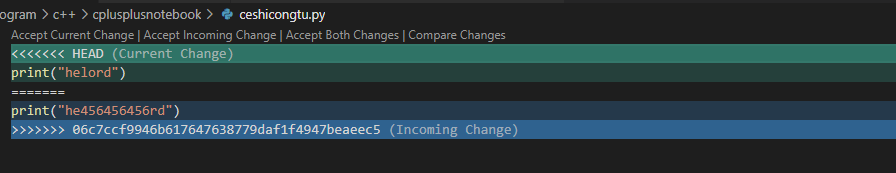

## git 基本用法


### 本地什么都没有，远程有的话

1. git clone 地址   将远程库的东西搞下来
2. 更改文件内容
3. git add <文件> 将文件增加到暂存区  可以用git add . 将所有文件都提交到暂存区
4. git commit -m “这里写提交的备注”   将暂存区的内容提交到本地仓库
5. git push 提交到远程仓库

## 之后修改的时候

git pull 就可以

## 遇到冲突

当我们在本地改一个文件的的某一行的时候，这个文件的这一行碰巧被别人修改了。此时会出现冲突。

现象就是：当我们正常提交到远程的时候他会报错


这时候我们需要从远端把最新代码pull下来


他会告诉我们 这个文件有冲突，我们需要把这个文件修改一下。

打开冲突的文件是这样的

我习惯用vscode修改：



改完之后 正常 add commit push 即可。

## 分支

### 远程有分支本地没有

```undefined
1.将某个远程主机的更新，全部取回本地：git fetch

2.查看远程分支：git branch -a

3.拉取远程分支到本地：git checkout -b 远程分支名 origin/远程分支名
```

### 本地新建分支，远程仓库没有

1. 创建分支并切换到该分支
     git checkout -b 新分支名
2. 创建分支，但不切换
     git branch 新分支名
3. 将创建的分支关联远程仓库
   	git push --set-upstream origin 分支名

### 想将dev分支合并到master分支，操作如下：链接：https://www.jianshu.com/p/26d050497abb

- 1、首先切换到master分支上

```undefined
git  checkout master
```

- 2、如果是多人开发的话 需要把远程master上的代码pull下来

```cpp
git pull origin master
//如果是自己一个开发就没有必要了，为了保险期间还是pull
```

- 3、然后我们把dev分支的代码合并到master上

```undefined
git  merge dev
```

- 4、然后查看状态及执行提交命令

```csharp
git status

On branch master
Your branch is ahead of 'origin/master' by 12 commits.
  (use "git push" to publish your local commits)
nothing to commit, working tree clean

//上面的意思就是你有12个commit，需要push到远程master上 
> 最后执行下面提交命令
git push origin master
```

- 5其他命令

```cpp
查看所有分支
git branch -a
删除远程分支Chapater6
git push origin --delete Chapater6
删除本地分支 Chapater6
git branch -d  Chapater6
```

## 子模块 submodule

参考：https://www.jianshu.com/p/9000cd49822c

### 添加子模块

此文中统一将远程项目`https://github.com/maonx/vimwiki-assets.git`克隆到本地`assets`文件夹。

```sh
$ git submodule add https://github.com/maonx/vimwiki-assets.git assets
```

### 克隆包含子模块的项目

1. 克隆父项目

```sh
$ git clone https://github.com/maonx/vimwiki-assets.git assets
```

1. 查看子模块

```sh
$ git submodule
 -e33f854d3f51f5ebd771a68da05ad0371a3c0570 assets
```

子模块前面有一个`-`，说明子模块文件还未检入（空文件夹）。

1. 初始化子模块

```sh
$ git submodule init
Submodule 'assets' (https://github.com/maonx/vimwiki-assets.git) registered for path 'assets'
```

初始化模块只需在克隆父项目后运行一次。

1. 更新子模块

```sh
$ git submodule update
Cloning into 'assets'...
remote: Counting objects: 151, done.
remote: Compressing objects: 100% (80/80), done.
remote: Total 151 (delta 18), reused 0 (delta 0), pack-reused 70
Receiving objects: 100% (151/151), 1.34 MiB | 569.00 KiB/s, done.
Resolving deltas: 100% (36/36), done.
Checking connectivity... done.
Submodule path 'assets': checked out 'e33f854d3f51f5ebd771a68da05ad0371a3c0570'
```


### 或者一步到位

### 递归克隆整个项目

```sh
git clone https://github.com/maonx/vimwiki-assets.git assets --recursive 
```

递归克隆整个项目，子模块已经同时更新了，一步到位。

 ### 更新子模块

进入到子模块目录中，正常add commit push即可、


## 常用命令总结

`git diff <filename>`命令：https://www.jianshu.com/p/80542dc3164e

​	查看工作区和暂存区的文件详细更改情况

`git diff --cached <filename>`

​	暂存区 vs Git仓库 -------也就是add 了但是没有commit的内容和最新一次 commit 时的内容的区别

`git diff <commitID> <commitID>`

​	查看两次commit 的差异。

`git status` 

​	查看 add 了哪些文件。

```
$ git reset HEAD ^            # 回退所有内容到上一个版本  
$ git reset HEAD ^ hello.php  # 回退 hello.php 文件的版本到上一个版本  
$ git  reset <commitID>          # 回退到指定版本
```

